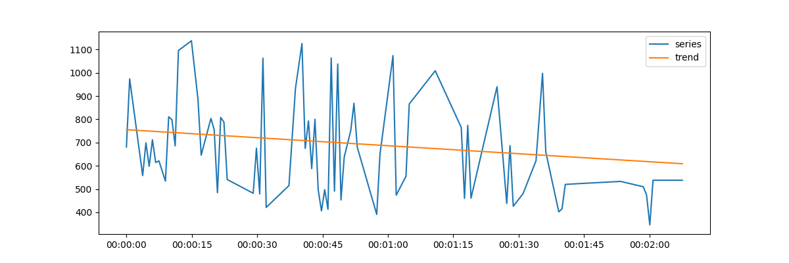
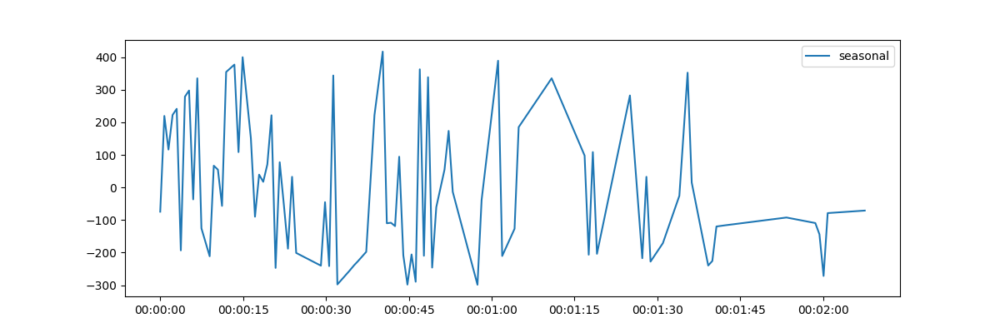
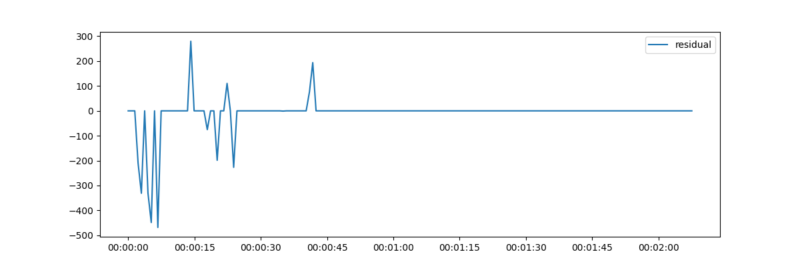
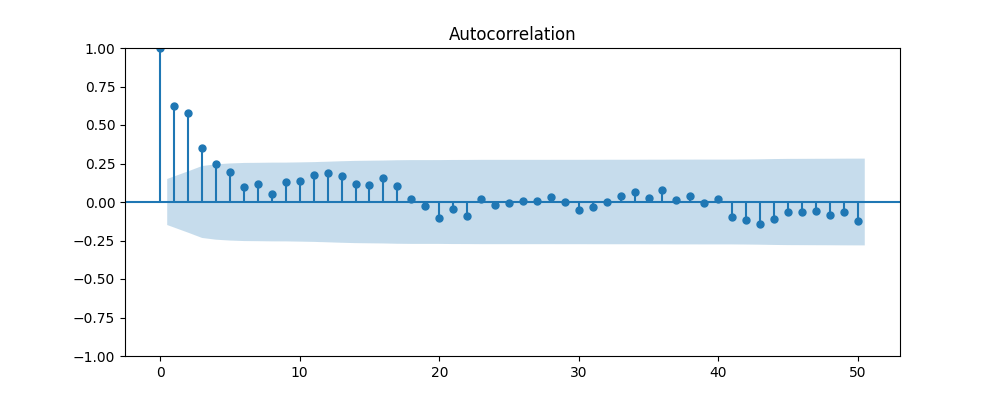
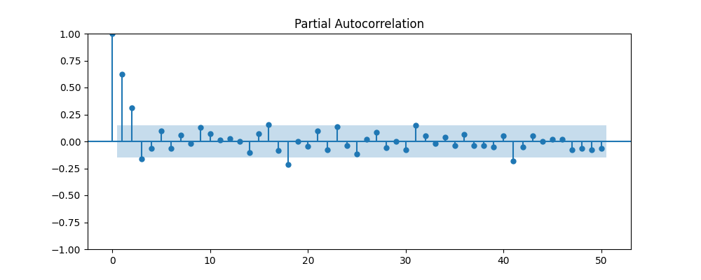
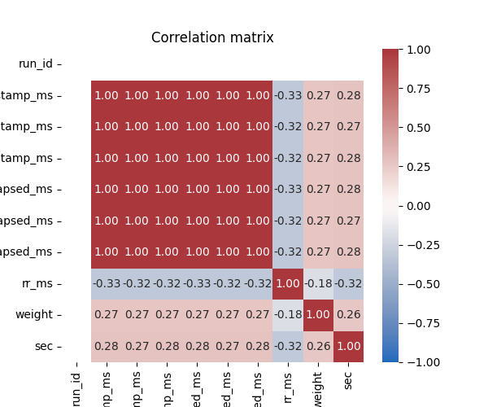
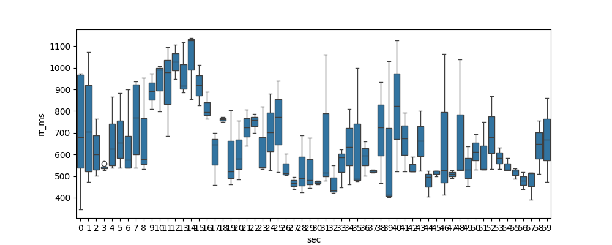

Time-series EDA pipeline

Summary:
- Purpose: Run a reproducible Exploratory Data Analysis (EDA) on short time-series recordings (RR intervals and auxiliary channels). The pipeline detects gaps, imputes missing values, decomposes the series, runs stationarity tests, computes ACF/PACF, detects outliers, and produces short-term ARIMA forecasts. It also generates visual artifacts for quick inspection.

Quick start

1. Create and activate a virtual environment, then install requirements:

```bash
python -m venv .venv
.\.venv\Scripts\activate
pip install -r ts_eda_pipeline/requirements.txt
```

2. Run the pipeline (replace the input path if needed):

```bash
python ts_eda_pipeline/eda_pipeline.py --input sakshi_rr_intervals_20260611T074737_len128s.csv
```

3. Open the notebook for an annotated walkthrough:

```bash
jupyter notebook ts_eda_pipeline/ts_eda_notebook.ipynb
```

Artifacts (saved to ts_eda_pipeline/artifacts/)

- **Time series / decomposition**: Trend, seasonal and residual plots show the decomposed components of the main series.
	- Trend: 
	- Seasonal: 
	- Residuals: 

- **Autocorrelation**: ACF and PACF help identify serial dependence and candidate AR/MA orders.
	- ACF: 
	- PACF: 

- **Correlation**: Numeric-column correlation heatmap (and rolling correlation when applicable) to inspect relationships.
	- Correlation matrix: 
	- Rolling correlation (rr_ms vs weight): `artifacts/rolling_corr_rr_weight.png` (if present)

- **Boxplots**: If the recording is short, a seconds-of-minute boxplot is produced; otherwise monthly/weekday boxplots are generated.
	- Example seconds boxplot: 

- **Forecast**: ARIMA short-term forecast (last 30s holdout) plus performance metrics.
	- Forecast predictions: `artifacts/forecast_arima_pred.npy`
	- Forecast metrics: `artifacts/forecast_arima_metrics.txt`

- **IR / Red superposition**: If `IR` and `Red` channels are available they will be normalized and saved. For this dataset proxies `rr_ms` and `weight` were used.
	- Min-max superimposed: `artifacts/rr_ms_weight_minmax.png`
	- Z-score superimposed: `artifacts/rr_ms_weight_zscore.png`
	- Z-score with detected peaks: `artifacts/rr_ms_weight_zscore_peaks.png`
	- Peaks list: `artifacts/rr_ms_weight_peaks.csv`

Notes on interpretation
- Missing timestamps / gaps: The script reports a median sampling interval and counts gaps larger than 1.5× median — large gaps usually indicate dropped samples or sensor pauses and should be inspected before modeling.
- Stationarity: The pipeline reports ADF and KPSS results. If ADF fails to reject the null (unit root) or KPSS rejects stationarity, consider differencing or detrending.
- Outliers: Residual z-scores (|z|>3) are marked as candidate anomalies. Verify against raw sensor traces to avoid removing valid physiological peaks.

Extending the pipeline
- To use real `IR`/`Red` channels, upload a CSV containing those columns (same folder) and re-run the pipeline. The script will automatically produce `ir_red_minmax.png`, `ir_red_zscore.png`, and `ir_red_peaks.csv`.
- I can add ARIMA/Prophet/LSTM comparisons and produce a single CSV with forecast vs actual and error columns if you want — tell me which model(s) to try.

Contact
- If you want me to regenerate artifacts with a provided `IR`/`Red` CSV, upload the file and I will run and attach the resulting plots and `ir_red_peaks.csv`.


